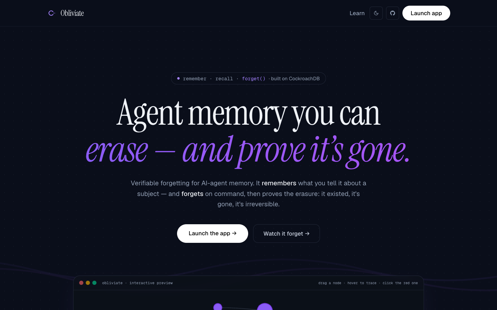
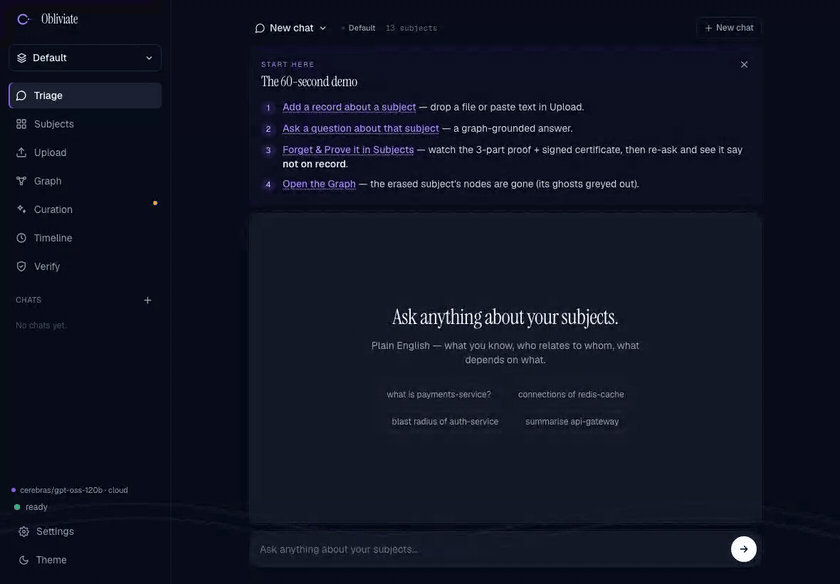
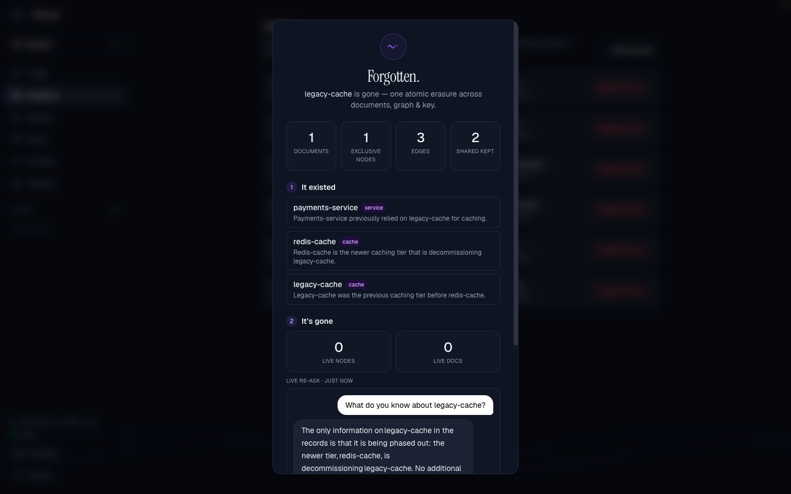
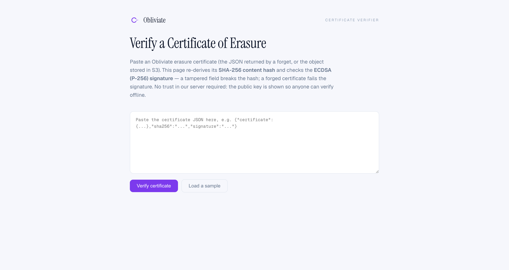
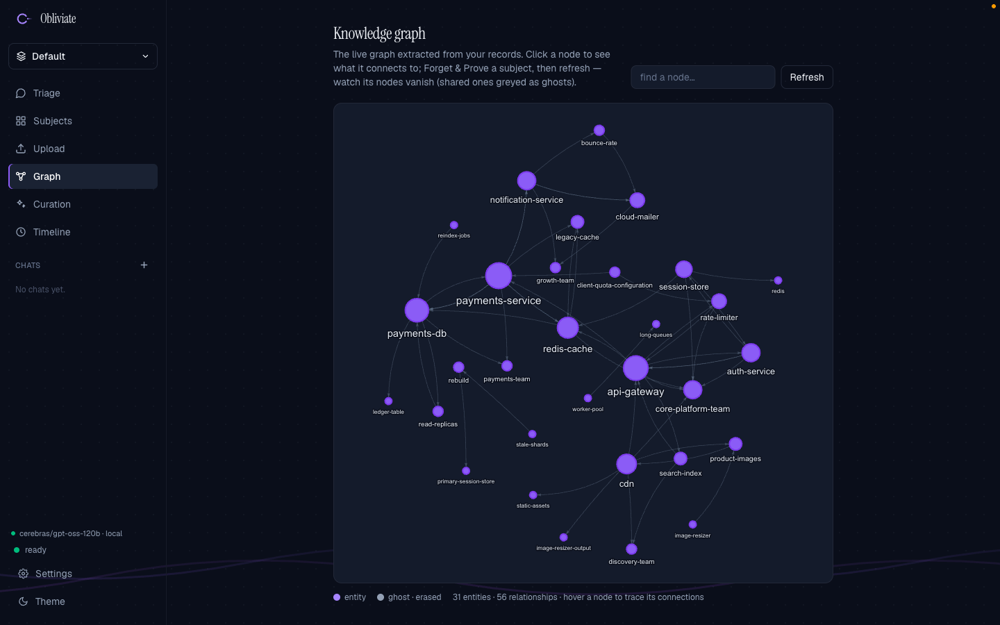
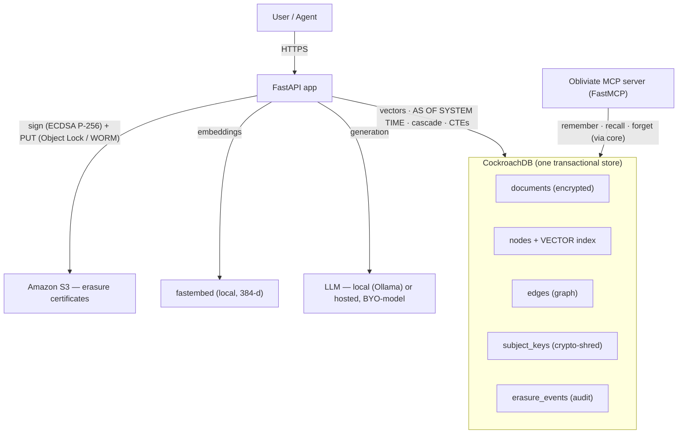

<div align="center">

# Obliviate

### Verifiable forgetting for AI-agent memory — CockroachDB-native

**When an agent's memory is wrong, poisoned, or legally required to disappear — can you delete it *everywhere*, atomically, and *prove* it's gone?**

Obliviate can. It cascade-deletes an entity's entire knowledge sub-graph — documents, graph nodes, edges, and vectors — in **one ACID transaction**, then proves erasure three ways: an `AS OF SYSTEM TIME` before/after diff, a live vector + graph re-search that returns nothing, and a crypto-shredded, object-locked deletion certificate.

`MIT licensed` · `CockroachDB Basic` · `Managed MCP Server` · `AWS S3 (Object Lock / WORM)` · `Independently verifiable`

<br>



<br>

*Living memory — the knowledge graph with real-time physics (47 entities · 83 relationships, all in CockroachDB):*


</div>

---

## The problem

Every agentic-memory project this cycle answers the same question: *how do agents remember more?* Almost none answer the question that governed, production memory actually demands: **how do agents forget — completely, safely, and provably?**

Memory that only ever accumulates is a liability. A poisoned or wrong fact propagates through the knowledge graph and corrupts future reasoning. A departed customer's data lingers past its legal retention window (EU GDPR Article 17 "right to erasure" is a 2026 enforcement priority). And in most systems, "delete" is a best-effort `DELETE` that leaves recoverable vectors on disk, orphaned graph edges, and no proof anything happened.

## What Obliviate does

Point it at an entity — a customer, a decommissioned system, a poisoned memory — and it performs **verifiable erasure**:

| Stage | Guarantee |
|-------|-----------|
| **Cascade delete** | The entity's documents, graph nodes, edges, and vectors are removed in **one serializable transaction** — never a half-erased state. |
| **Shared-node safety** | Entities shared with a *surviving* subject are **invalidated, not deleted** — erasing one subject never corrupts another's memory. |
| **Crypto-shred** | The subject's per-record encryption key is destroyed, so residual ciphertext (in MVCC history, backups, or S3) is **cryptographically unrecoverable** — not merely dereferenced. |
| **Proof of prior existence** | `AS OF SYSTEM TIME` reconstructs exactly what the graph knew *before* erasure — the database's own memory of itself, no separate audit log. |
| **Proof of absence** | A live vector + graph re-search returns nothing; the agent answers *"not on record."* |
| **Certificate** | A signed, **object-locked (WORM) S3** certificate makes each erasure tamper-evident. |

Two applications of the same primitive:
- **Data-integrity / incident response** — a poisoned or wrong fact entered your agent's memory. Cut it out cleanly, cluster-wide, and prove the graph is clean again.
- **Compliance** — GDPR/HIPAA right-to-erasure with a certificate you can hand an auditor.

### Grounded recall — with sources, and honest about absence

Ask in plain English. Answers are grounded **strictly** in the stored graph, cite their sources, and decline honestly when a fact isn't on record — the exact behavior that makes forgetting provable.



### Forget & Prove — the hero

One click erases a subject in a single ACID transaction, then proves it three ways — *it existed* (AS OF SYSTEM TIME), *it's gone* (live vector + graph re-check), *it's irreversible* (crypto-shred + object-locked S3 certificate).

| The 3-part proof | The signed certificate |
|:---:|:---:|
|  |  |

**Verify it yourself** — anyone can re-check a certificate at **`/verify`**: it re-derives the SHA-256 content hash and checks the ECDSA (P-256) signature, and shows the public key so the signature can be verified offline. A tampered field breaks the hash; a forged certificate fails the signature.



The knowledge graph (47 entities · 83 relationships, live physics) and the in-app docs:

| Knowledge graph | Docs (`/learn`) |
|:---:|:---:|
|  |  |

## Why CockroachDB (load-bearing, not a checkbox)

Obliviate unifies what normally takes three systems — a graph database, a vector store, and an audit log — into **one durable, governed store**. That is only possible because of CockroachDB primitives:

- **Distributed Vector Indexing (C-SPANN)** — semantic recall over `VECTOR(384)` columns, *index-backed* (verified via `EXPLAIN`), living in the same table as the relational data.
- **`AS OF SYSTEM TIME`** — MVCC time-travel *is* the deletion receipt. No bolt-on history table to trust.
- **Serializable transactions** — the cascade delete + invalidate + crypto-shred either all commit or none do.
- **Recursive CTEs** — exhaustive, by-construction blast-radius traversal of the knowledge graph.
- **Row-level TTL** — retention enforced by the storage engine. Opt-in per row (`ttl_expire_at`): documents expire only when a retention policy sets it, so nothing is deleted by a blanket clock.
- **Managed MCP Server (independent verification)** — Obliviate wires CockroachDB Cloud's **own managed MCP endpoint** (`cockroachlabs.cloud/mcp`). This is the strongest form of the erasure claim: an auditor doesn't have to trust *our* API when it says "it's gone" — they point their own MCP agent at Cockroach Labs' hosted endpoint and `select_query` the cluster directly to confirm the forgotten subject's rows are truly absent. Proof that never routes through Obliviate's code. See [`docs/MCP.md`](docs/MCP.md).
- **MCP-native (our own tools)** — Obliviate *also* ships its own MCP server (FastMCP) backed by the same cluster, so any MCP agent (Claude Desktop/Code, Cursor) can remember, recall, and *provably forget* through high-level tools.

**CockroachDB tools used (load-bearing):** CockroachDB Cloud Managed MCP Server · Distributed Vector Indexing (C-SPANN) · `AS OF SYSTEM TIME` · Serializable transactions · Recursive CTEs · Row-level TTL.
**AWS services used:** S3 (object-locked / WORM erasure certificates) · EC2 (hosting). Certificates are signed **in-process** with ECDSA (P-256); a Lambda-based signer is an optional deployment variant, not required.

## Architecture



## How it works

- **Ingest** — a document is stored encrypted under its subject's key; an LLM extracts entities and relationships; nodes are upserted by name (`INSERT … ON CONFLICT` = deterministic coreference dedup) and edges inserted — all in the one store.
- **Ask** — cosine ANN finds the relevant entities, a recursive CTE expands the surrounding graph, and a strictly-grounded prompt answers **only** from that context, declining honestly when a fact is absent (the property that makes forgetting provable).
- **Forget** — the transaction described above.

## Quickstart

```bash
python -m venv .venv && source .venv/bin/activate
pip install -r requirements.txt
cp .env.example .env          # set DATABASE_URL, LLM provider, AWS
python scripts/init_db.py     # apply schema + self-test
uvicorn app.main:app --port 8080
```

**Bring your own model.** The LLM layer is provider-agnostic — point it at a local Ollama model or any hosted OpenAI-compatible provider by editing `.env` (or from the in-app model picker). No provider lock-in.

## Evaluation

Obliviate implements research-backed *layered* deletion rather than naive `DELETE`:

- Naive deletion is only **~18%** robust to reconstruction attacks; dependency-graph-aware layered deletion reaches **~94%** (*ForgetAgent*, IJRASET).
- API-confirmed vector deletion leaves embeddings physically recoverable from the raw index on disk — *Ghost Vectors* (arXiv:2606.18497) reconstructs **25.5% of exact names and 46.4% of locations** from text embeddings (and up to ~99% from image embeddings); crypto-shredding a per-subject key drops recovery to **0%** (the paper's own "Epoch Key Rotation" fix — encrypt, then discard the key).

The eval harness (`evals/`) reproduces a forget-correctness benchmark (blind-judge scored) and a Reconstruction-Robustness Score comparing naive deletion vs. Obliviate.

## Prior work & attribution

Obliviate's **visual design and UI are adapted from my earlier open-source project, Lethe**, which
explored verifiable forgetting on a different stack (Cognee + Kùzu + LanceDB). **The CockroachDB-native
memory engine is newly built for this hackathon** — the knowledge graph as relational tables, vectors
in the C-SPANN index, the atomic transactional `forget`, the `AS OF SYSTEM TIME` proof, the per-subject
crypto-shred, and the signed erasure certificate. Moving to CockroachDB is precisely what makes
forgetting a **single ACID transaction** and the certificate provable from the database itself —
something that was impossible when the graph and vectors lived in two separate stores.

## What's new here

Structurally new versus the prior project: a **single ACID cascade** across a distributed SQL + vector
store (replacing three separate systems and their consistency gaps), **`AS OF SYSTEM TIME`** as the proof
mechanism, **object-locked crypto-shred certificates**, and an **exhaustive recursive-CTE blast-radius**.

## Honest limitations

- Erasure removes data from the store; it does not unlearn an LLM's parametric priors (which is why the grounding prompt is strict and honesty is verified behaviorally).
- Coreference is name-based; entities that should be distinct can merge and vice-versa.
- The `AS OF SYSTEM TIME` window is bounded by the cluster GC window; the append-only audit trail and S3 certificate provide durability beyond it.

## License

[MIT](LICENSE) © 2026 Vinayak Sonthalia
