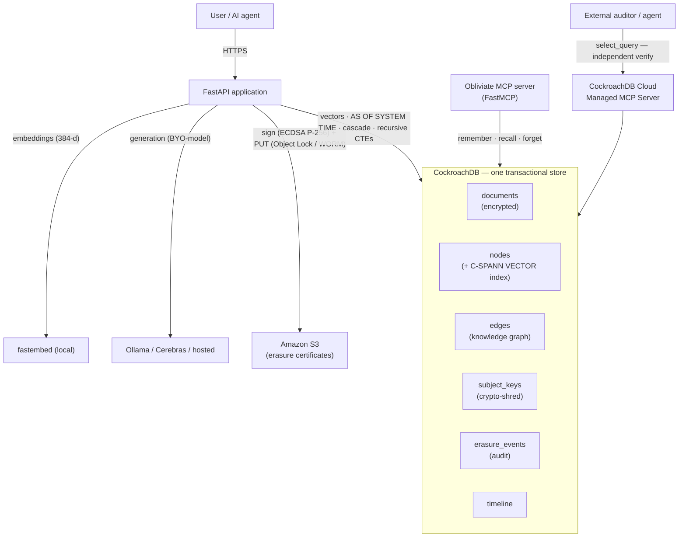
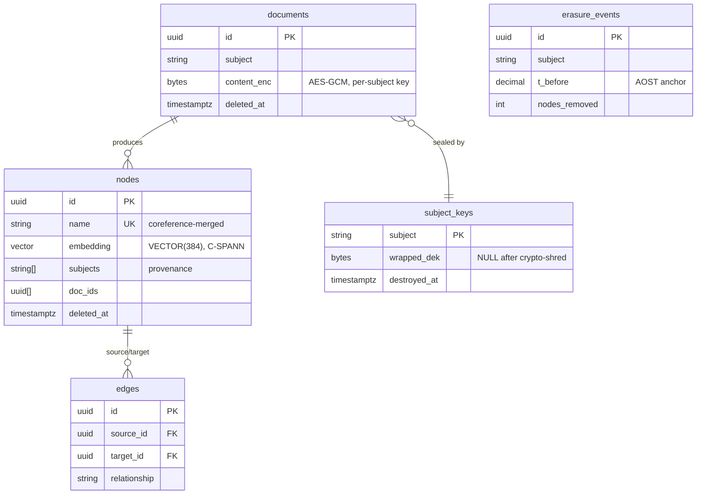

# Obliviate — Architecture

Obliviate collapses three systems — a graph database, a vector store, and an audit log — into
**one CockroachDB store**, so that erasure can be a single atomic, provable operation.

## System overview

## The forget flow — one ACID transaction + three proofs

```mermaid
sequenceDiagram
    participant C as Client
    participant API as FastAPI
    participant DB as CockroachDB
    C->>API: POST /api/forget {subject}
    API->>DB: t_before = cluster_logical_timestamp()
    rect rgb(40,20,20)
    note over API,DB: ONE serializable transaction
    API->>DB: DELETE exclusive nodes + their edges
    API->>DB: DELETE subject's documents
    API->>DB: UPDATE shared nodes (remove subject — retained for others)
    API->>DB: crypto-shred subject_keys (destroy DEK)
    API->>DB: INSERT erasure_events (measured receipt)
    end
    API->>DB: SELECT ... AS OF SYSTEM TIME t_before   %% proof 1: it existed
    API->>DB: SELECT live nodes/docs + key state       %% proof 2: it's gone
    API-->>C: { receipt, proof_prior_existence, proof_of_absence }
    note right of C: proof 3 (irreversible):<br/>key destroyed + signed S3 certificate
```

## Data model

## Request flows

- **Ingest** — `prose → encrypt(document) → LLM extract entities/relationships → UPSERT nodes
  (ON CONFLICT = coreference dedup) + INSERT edges + embeddings`, one store.
- **Ask** — `embed(query) → cosine ANN seed nodes → recursive CTE graph expansion →
  serialize context → grounded LLM answer (declines honestly on absent facts)`.
- **Forget** — the sequence above.

## Design rationale

| Choice | Why |
|--------|-----|
| One store (not graph DB + vector DB + log) | Erasure is one ACID transaction; no cross-store drift, no dual-write cache-invalidation bug. |
| MVCC `AS OF SYSTEM TIME` as the receipt | The database's own history *is* proof of prior state — no separate, tamperable audit table. |
| Per-subject envelope encryption + crypto-shred | Deletion alone leaves recoverable bytes (MVCC/backups); destroying the key makes them unrecoverable. |
| Recursive CTE for blast-radius | Exhaustive graph reachability by construction, not approximate/relevance-ranked. |
| Shared-node invalidate (not delete) | Erasing one subject never corrupts another's memory. |
