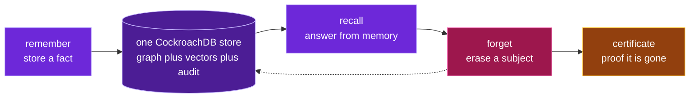

# What is this?

**In one line:** Obliviate is agent memory you can *erase* — completely, in one
atomic transaction — and then *prove* it's gone.

Every agentic-memory project this cycle answers the same question: *how do agents
remember more?* Obliviate answers the one that regulated, production memory actually
demands: **when a memory is wrong, poisoned, or legally required to disappear — can
you delete it everywhere, atomically, and prove it?**

*The whole loop, over one store:*

## ELI10

Imagine an assistant that has read every runbook your team ever wrote. One night
something breaks and it tells you exactly what to check — calm, in plain words.

Now the clever part. Last month you decommissioned the old cache. A *dumb* assistant
still says "check the old cache!" — because it remembers everything forever, including
junk. Obliviate is smarter: when something is retired, it can be **forgotten** — the
documents, the graph entities, the vectors, and the encryption key — so it never sends
you chasing a thing that no longer exists. And it hands you a **certificate** proving
the forget happened.

Most people build memory that *remembers more*. Obliviate is built to **forget the
right things, on command, and prove it.**

## Why "forgetting" is the hard half

Deletion in most systems is a best-effort `DELETE` that leaves recoverable vectors on
disk, orphaned graph edges, and no proof anything happened. Obliviate makes deletion a
**first-class, verifiable operation** — which turns out to be exactly what a database
built for correctness (CockroachDB) is uniquely good at.
