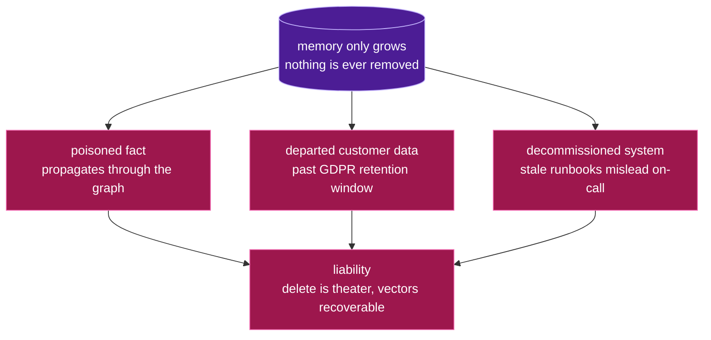

# The problem: memory only accumulates

Agent memory that only ever grows is a liability.

*Three ways an ever-growing store turns into a liability:*

- **A poisoned or wrong fact** propagates through the knowledge graph and corrupts
  every future answer. You need to cut it out cleanly — everywhere it reached.
- **A departed customer's data** lingers past its legal retention window. The EU GDPR
  Article 17 "right to erasure" is a 2026 enforcement priority; "we deleted the row"
  is not the same as "it's unrecoverable."
- **A decommissioned system** leaves stale runbooks that mislead on-call at 3am.

And in most systems "delete" is theater:

> A vector store's API-confirmed delete still leaves the embedding **~99%
> reconstructible** from the raw index files on disk *(Ghost Vectors, arXiv:2606.18497)*.

So the real question isn't "did we call delete?" — it's **"can we prove the thing is
gone, everywhere, and can't come back?"** That is the problem Obliviate is built to
solve.
