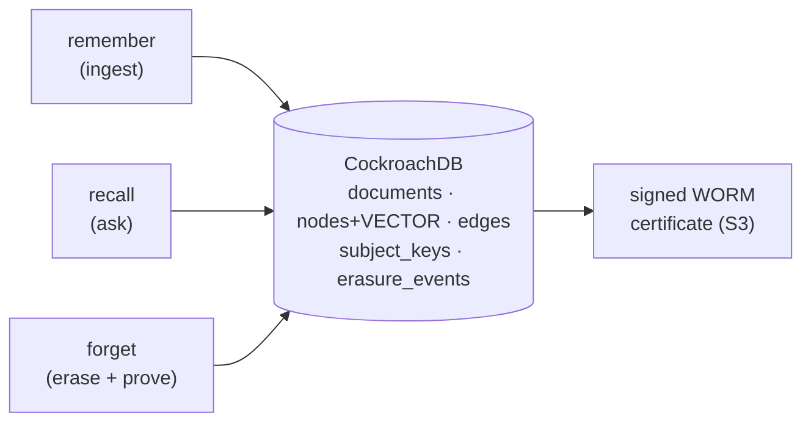

# The pipeline, end to end

Obliviate stores an agent's memory as a **knowledge graph *and* vectors *and* an audit
trail — in one CockroachDB store**. Three verbs move through it:

- **remember** — a document is stored *encrypted* under its subject's key; an LLM
  extracts entities and relationships; nodes are upserted by name and edges inserted —
  all in the one store.
- **recall** — cosine ANN finds the relevant entities, a recursive CTE expands the
  surrounding graph, and a strictly-grounded prompt answers **only** from that context,
  declining honestly when a fact is absent.
- **forget** — one serializable transaction removes the subject's exclusive documents,
  nodes, edges and vectors, invalidates shared nodes, and crypto-shreds the key — then
  proves it three ways.

The honesty of **recall** is what makes **forget** provable: if the agent will say
"not on record" when it truly has nothing, then a post-forget "not on record" *means*
something.
