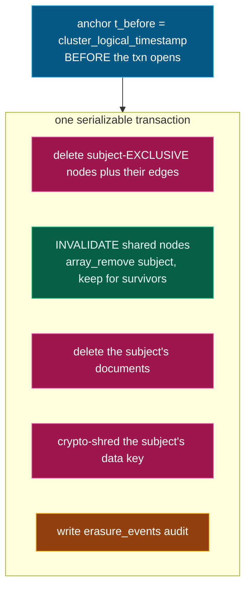

# Forget: the hero

`forget(subject)` is **one serializable CockroachDB transaction**. Either all of it
commits or none of it does — memory is never left half-erased.

*One atomic transaction, anchored by a timestamp taken just before it:*

Two design decisions carry the weight:

1. **Exclusive vs. shared.** A node that belongs *only* to this subject is deleted. A
   node shared with a surviving subject is **kept**, with just this subject's provenance
   removed (`array_remove`). Erasing one customer never corrupts another's memory.
2. **The timestamp is anchored *before* the transaction.** `cluster_logical_timestamp()`
   inside the deleting txn equals the commit timestamp — so an `AS OF SYSTEM TIME`
   read at that value would see the *post*-delete state and prove nothing. Anchoring it
   in a prior statement means the deletes commit strictly later, and the proof reads the
   real pre-delete state. (We verified this empirically: 1 row vs 0.)
