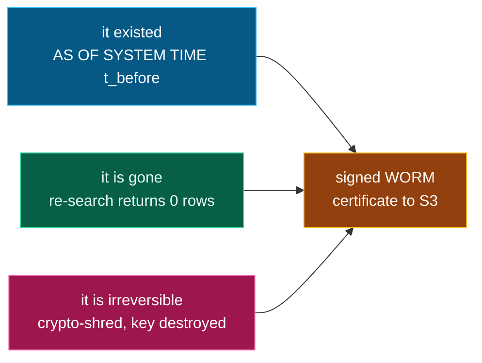

# The three proofs

A `forget` returns a bundle that proves erasure three independent ways.

*The three proofs, each independent, combine into one certificate:*

### 1 — It existed *(proof of prior existence)*
Using CockroachDB's `AS OF SYSTEM TIME t_before`, we reconstruct exactly what the graph
knew the instant before erasure. **The database's own MVCC history is the receipt** — no
separate audit log to trust.

### 2 — It's gone *(proof of absence)*
A live re-check queries the database *now*: zero exclusive nodes, zero documents remain
for the subject, and a **vector ANN re-search** returns no surviving node that still
carries the subject. Shared entities are confirmed retained for other subjects.

### 3 — It's irreversible *(crypto-shred)*
Each subject's documents are sealed under their own AES-256-GCM data key. Forget
**destroys that key**, so residual ciphertext in MVCC history, backups, or S3 is
cryptographically unrecoverable — not merely dereferenced. We then issue a signed,
object-locked (WORM) certificate to S3.

Together: *it was here · it isn't anymore · it can't come back* — and a tamper-evident
certificate you can hand an auditor.
