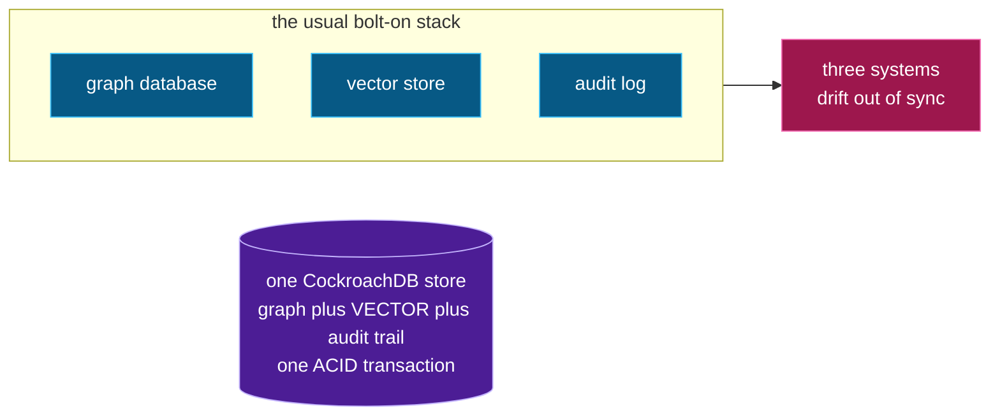

# Why CockroachDB (load-bearing, not a checkbox)

Obliviate unifies what normally takes **three systems** — a graph database, a vector
store, and an audit log — into **one durable, governed store**. That is only possible
because of specific CockroachDB primitives:

*Three bolt-on systems collapse into one transactional store:*

| Capability | What it does for Obliviate |
|---|---|
| **Distributed Vector Index (C-SPANN)** | Semantic recall over `VECTOR(384)` columns, *index-backed* (verified via `EXPLAIN`), in the same table as the relational data. |
| **`AS OF SYSTEM TIME`** | MVCC time-travel *is* the deletion receipt. No bolt-on history table to trust. |
| **Serializable transactions** | The cascade delete + invalidate + crypto-shred either all commit or none do. |
| **Recursive CTEs** | Exhaustive, by-construction blast-radius traversal of the graph. |
| **Row-level TTL** | Retention enforced by the storage engine. |

**Would it collapse on Postgres?** The idea does. Postgres has no `AS OF SYSTEM TIME`
(so the proof-of-prior-existence would need a separate, trust-me audit table), and no
distributed C-SPANN vector index. Moving to CockroachDB is precisely what makes
forgetting a **single ACID transaction** and the certificate **provable from the
database itself**.
