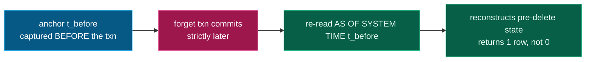

# AS OF SYSTEM TIME: the receipt

Most "verifiable deletion" systems keep a separate audit table that says *"we deleted
X."* You have to trust that table. Obliviate doesn't need one: CockroachDB's MVCC lets
us read the database **as it was** at a past timestamp.

*Anchor before, delete, then read the past to reconstruct pre-delete state:*



```sql
SELECT name, type, description
FROM nodes AS OF SYSTEM TIME '<t_before>'
WHERE workspace = $1 AND $2::STRING = ANY(subjects);
```

`t_before` is a `cluster_logical_timestamp()` captured **before** the deleting
transaction opens. That ordering is load-bearing:

> If you anchor the timestamp *inside* the deleting transaction, it equals the commit
> timestamp — and an `AS OF SYSTEM TIME t_before` read then sees the *post*-delete
> state, returning **zero rows**. The proof proves nothing.

We hit exactly this and fixed it by anchoring one statement earlier (verified: **1 row
vs 0**). Now the same query, run after the forget, reconstructs precisely what existed
the instant before erasure. **Your audit log can lie. MVCC can't.**

The window is bounded by the cluster GC window; the append-only `erasure_events` table
and the S3 certificate provide durability beyond it.
