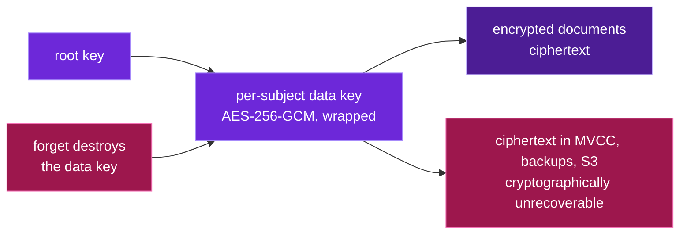

# Crypto-shred & row-level TTL

## Crypto-shred: irreversibility

Deleting a row doesn't erase its bytes from MVCC history, backups, or a leaked snapshot.
So Obliviate uses **envelope encryption**: every document is encrypted with a per-
`(workspace, subject)` AES-256-GCM data key, and that key is wrapped by a root key.

*Destroy one small key and every copy of the ciphertext becomes unrecoverable:*



`forget` **destroys the wrapped data key**. Without it, the ciphertext — wherever it
survives — is cryptographically unrecoverable. This mirrors the *Ghost Vectors* paper's
"Epoch Key Rotation," which drops PII recovery from ~99% to **0%** while generating a
cryptographic proof of deletion.

```text
before forget:  decrypt_for(subject, ciphertext) -> plaintext
after forget:   key destroyed -> decrypt returns None   (verified)
```

## Row-level TTL: retention by the engine

Documents carry a nullable `ttl_expire_at`, and the table is configured with:

```sql
ALTER TABLE documents SET (ttl_expiration_expression = 'ttl_expire_at',
                           ttl_job_cron = '@hourly');
```

The storage engine reaps expired rows on its own. It's **opt-in per row** — a `NULL`
expiry never expires — so retention is a policy you set on aged, low-importance records,
not a blanket clock that could delete demo data out from under you.
