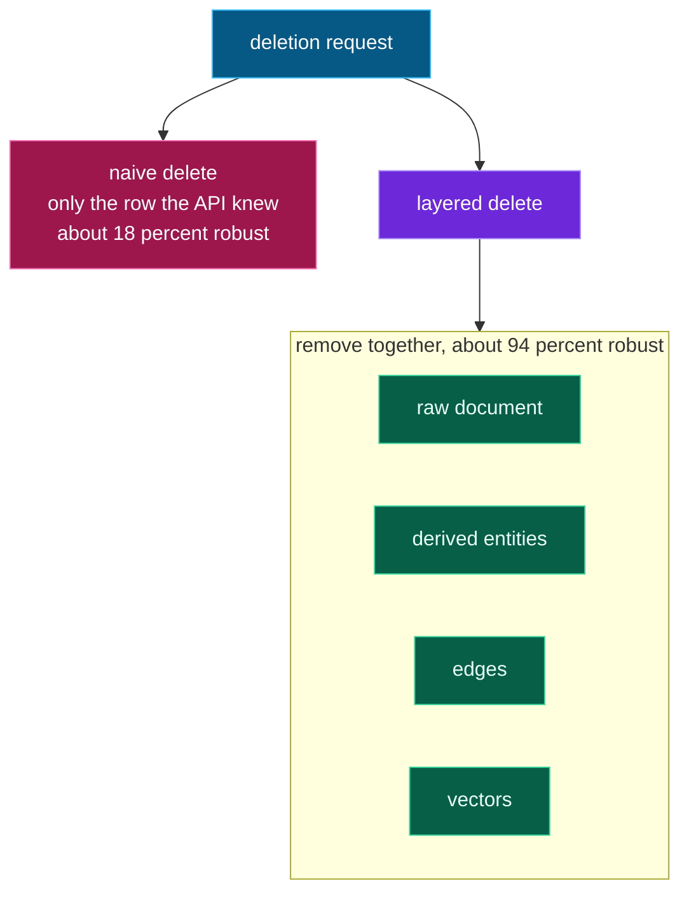

# The research: why naive deletion fails

Obliviate's design is grounded in two 2026 papers on verifiable deletion.

*Naive deletion touches one layer; layered deletion removes them together:*

## Ghost Vectors (arXiv:2606.18497)

*"Ghost Vectors: Soft-Deleted Embeddings Remain Reconstructible in HNSW Vector
Databases."* When a RAG system honors a deletion request with a soft-delete, the
embedding stays physically recoverable from the raw index files. The authors recover
**25.5% of exact person names and 46.4% of geographic locations** from biographical
data, and up to **99% identity recovery** from facial embeddings.

Their fix — **Epoch Key Rotation**: encrypt embeddings and discard the key on deletion,
dropping PII recovery to **0%** with a cryptographic proof of deletion. This is exactly
Obliviate's crypto-shred.

## ForgetAgent — layered deletion (IJRASET)

*"ForgetAgent: Verifiable Deletion in Multi-Layer Memory Architectures for LLM Agents."*
It identifies an attack surface across seven memory layers (raw text, embeddings,
summaries, derived entities, tool transcripts, neighborhoods, context) and shows that
**naive deletion is only ~18% robust** to reconstruction, while dependency-graph-aware
**layered deletion reaches ~94%**. Obliviate implements the layered approach: it deletes
the document, the derived graph entities, the edges, and the vectors — together — rather
than just the row the API was told about.
