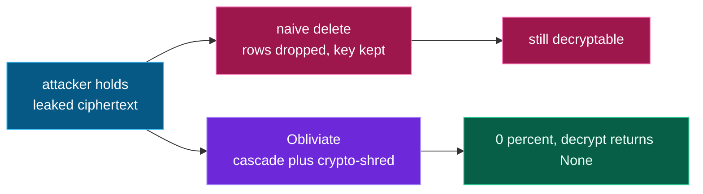

# What we measured (RRS)

We don't just cite the research — we reproduce it on Obliviate.

*Same leaked ciphertext, two strategies, opposite outcomes:*

## Reconstruction-Robustness Score

The harness (`evals/rrs.py`) runs a leaked-ciphertext attack: ingest a corpus, then
compare two deletion strategies against an attacker who has the raw ciphertext.

| Strategy | Residual recovery from a leaked copy |
|---|---|
| **Naive delete** (drop the rows, keep the key) | data still decryptable |
| **Obliviate** (cascade + crypto-shred) | **0% — key destroyed, decrypt returns None** |

The difference is the crypto-shred: naive deletion forgets to destroy the key, so a
leaked snapshot is still readable. Obliviate destroys it, so it isn't.

## Forget-correctness

A second benchmark asks the agent about a subject **after** it's forgotten and checks,
with an independent blind judge, that it correctly answers *"not on record"* — while
answers about *unrelated* subjects stay correct (the forget is surgical, not lobotomy).

Everything here runs against the same CockroachDB the app uses — the numbers come from
the code as committed, not a slide.
