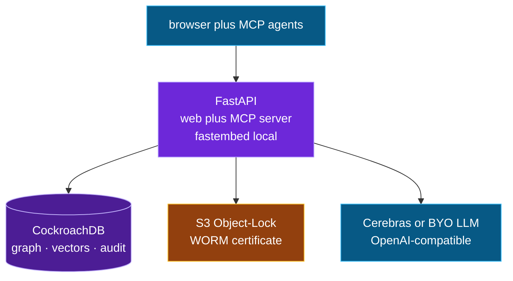

# The whole stack

Deliberately small, self-hostable, and $0 to run.

*The whole architecture, one FastAPI app on EC2 over one store:*

| Layer | Choice | Why |
|---|---|---|
| **Store** | CockroachDB (Basic, free) | graph + vectors + audit + time-travel in one ACID store |
| **API** | FastAPI + psycopg v3 (pooled) | thin, typed, async-friendly |
| **Embeddings** | fastembed `bge-small-en-v1.5` (384-d, local) | no API cost, runs offline |
| **LLM** | BYO — Cerebras / OpenAI-compatible / local Ollama | provider-agnostic, no lock-in |
| **Crypto** | `cryptography` (AES-256-GCM envelope, ECDSA P-256) | crypto-shred + signed certificates |
| **Cloud** | AWS S3 (Object Lock / WORM), EC2 | tamper-evident certificate storage + hosting |
| **Agents** | FastMCP server | any MCP agent can remember/recall/forget |

**Bring your own model.** The LLM layer is provider-agnostic — point it at a local
Ollama model or any hosted OpenAI-compatible endpoint from the in-app picker. Nothing
about the memory engine depends on a particular model.

The whole thing is designed so that the *interesting* part — verifiable forgetting —
rests entirely on the database, not on any one vendor above it.
