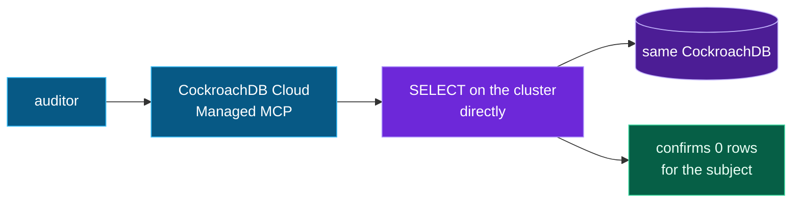

# The MCP server

Obliviate ships its own **MCP server** (FastMCP) so any MCP-compatible agent — Claude
Desktop / Code, Cursor — can use verifiable memory as tools, backed by the same
CockroachDB the web app uses.

*An auditor can verify erasure without trusting the app:*



```
claude mcp add obliviate -- python /ABS/PATH/obliviate/mcp_server.py
```

Five tools:

| Tool | What it does |
|---|---|
| `remember(subject, text)` | store a memory; extract entities + relationships |
| `recall(query)` | answer strictly from memory; says "not on record" when it doesn't know |
| `forget(subject)` | verifiably erase a subject; returns the 3-part proof |
| `list_subjects()` | what's currently held in this workspace |
| `memory_timeline()` | recent ingest / forget / demote / restore events |

`forget` through the MCP layer returns the same proof bundle as the API —
prior-existence via `AS OF SYSTEM TIME`, live proof-of-absence, and crypto-shred — so an
agent doesn't just delete a memory, it can **prove** it did.
